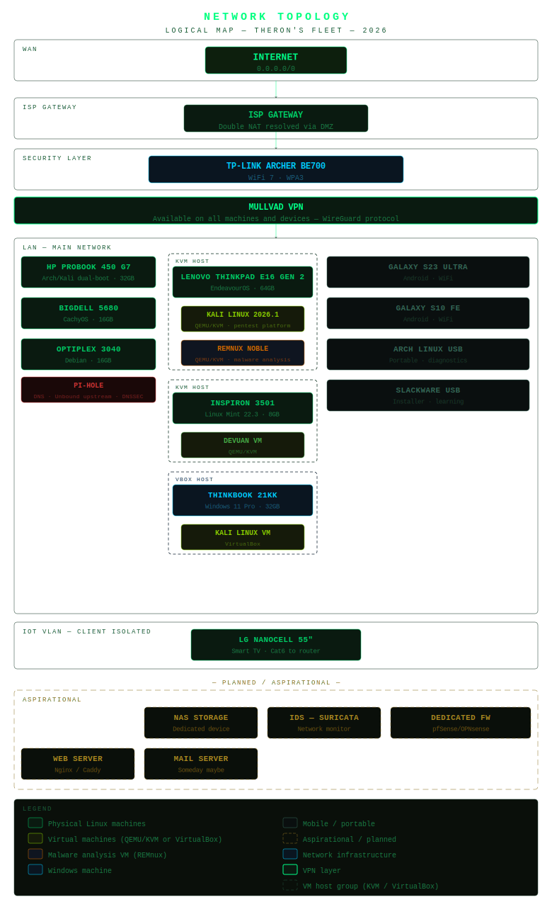

# Home Lab Network Topology
## Logical Network Map — 2026

---

## Overview

Documents the logical network layout of my home lab including
all machines, network segments, VPN configuration, and planned
additions. A full SVG network diagram is included above.

---

## Network Infrastructure

| Device | Role | Details |
|---|---|---|
| TP-Link Archer BE700 | Primary Router | WiFi 7, WPA3, Quad9 DNS, WireGuard VPN server |
| ISP Gateway | ISP Modem | Double NAT resolved via DMZ |
| virbr0 | Virtual Bridge | libvirt NAT bridge for QEMU/KVM VMs on Lenovo ThinkPad |

---

## Network Segments

### Main LAN
All primary workstations and laptops

### IoT VLAN
- Dedicated isolated network for smart devices
- Client isolation enabled
- Internet access only — cannot reach main LAN

### Virtual Network (virbr0)
- NAT bridge managed by libvirt on Lenovo ThinkPad
- Confirmed active via libvirtd and dnsmasq
- Serves DHCP to Kali and REMnux VMs
- Start VMs before enabling Mullvad to avoid
  DHCP conflicts on eth0

---

## Machine Network Roles

| Machine | Segment | Notes |
|---|---|---|
| Lenovo ThinkPad E16 Gen 2 | Main LAN | QEMU/KVM host, Mullvad app |
| HP ProBook 450 G7 | Main LAN | Manual WireGuard via Mullvad keys over NetworkManager |
| BigDell Inspiron 5680 | Main LAN | Desktop workstation |
| OptiPlex 3040 | Main LAN | Proxmox VE hypervisor, backup server |
| Inspiron 3501 | Main LAN | General use |
| ThinkBook 21KK | Main LAN | Windows environment, VirtualBox host |
| Kali Linux 2026.1 VM | virbr0 (NAT) | QEMU/KVM on Lenovo ThinkPad |
| REMnux VM | virbr0 (NAT) | QEMU/KVM on Lenovo ThinkPad |
| Kali Linux VM | Local (VirtualBox) | VirtualBox on ThinkBook |
| Devuan VM | virbr0 (NAT) | QEMU/KVM on Inspiron 3501 |
| Galaxy S23 Ultra | WiFi | Primary phone |
| Galaxy S10 FE | WiFi | Tablet |
| LG NanoCell 55" | IoT VLAN | Smart TV · Cat6 to router · client isolated |

---

## VPN Configuration

| Machine | VPN | Method |
|---|---|---|
| Lenovo ThinkPad E16 | Mullvad | Mullvad app |
| HP ProBook/Kali | Mullvad | Manual WireGuard config via NetworkManager |
| All other machines | Mullvad | Available on all devices |
| Router | WireGuard | Self-hosted VPN server for remote access |

---

## DNS

| Setting | Value |
|---|---|
| Upstream DNS | Quad9 (9.9.9.9) |
| Malware blocking | Yes — via Quad9 |

---

## Planned Additions

| Addition | Status |
|---|---|
| Pi-hole | Planned — as Proxmox VM |
| NAS/Storage server | Aspirational |
| Dedicated IDS (Suricata) | Aspirational |
| Dedicated firewall device | Aspirational |
| Web server | Aspirational |

---

*Last updated: April 22nd, 2026*
