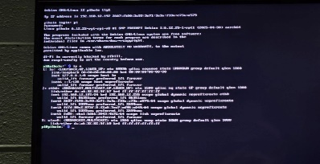
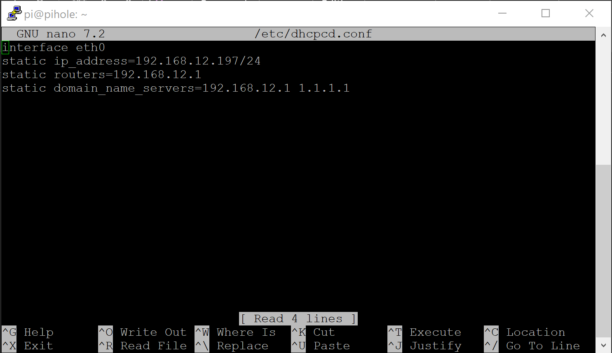
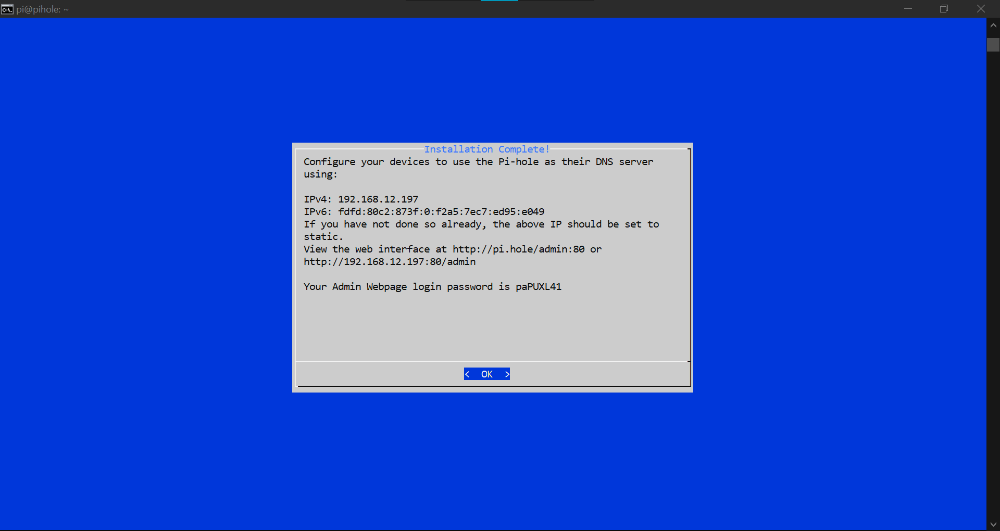
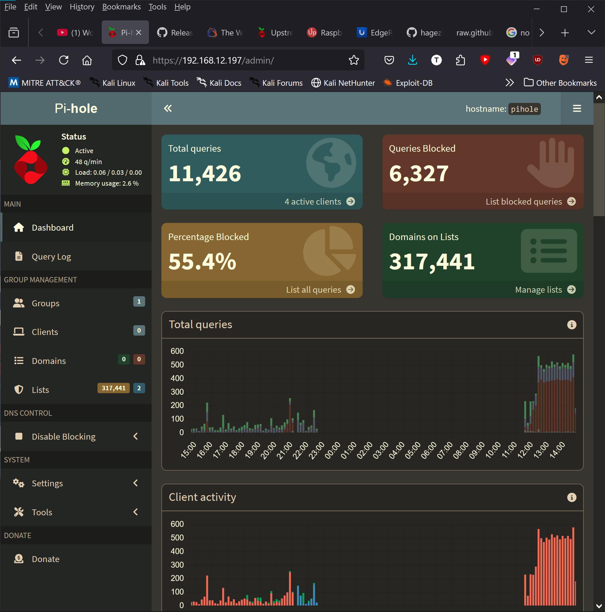

# Pi-hole on Raspberry Pi 4
## Local IT Training Program — Capstone Project, Summer 2025

---

## Overview

Deployed Pi-hole on a Raspberry Pi 4 as a network-wide DNS sinkhole,
blocking ads, trackers, and malicious domains for devices on the network.
This was the capstone project for my local IT training program.

The short version: it works. No. More. Ads.

---

## Hardware & Tools Used

| Component | Details |
|---|---|
| Device | Raspberry Pi 4 |
| microSD Card | 16GB |
| microSD Reader | Standard USB microSD Card Reader |
| Ethernet | Standard Cat6 Ethernet Cable |
| Host Machine | Windows 10 Pro laptop |
| SSH Client | PuTTY |
| Imager | Raspberry Pi Imager 1.8.5 |

---

## Step 1 — Flash the SD Card

- Downloaded Raspberry Pi Imager from https://www.raspberrypi.com/software/
- Selected device: **Raspberry Pi 4**
- Selected OS: **Raspberry Pi OS Lite (64-bit)**
- Selected storage: microSD card

**OS Customization settings applied:**
- Hostname set to: `pihole`
- Username: `pihole` with strong password
- Locale and timezone configured
- SSH enabled (password authentication)
- Telemetry disabled

**What went wrong:**
Had to load the SD card into another machine and run GParted to erase
and recreate the partition. The imager kept trying to assign two drive
letters when inserting the card reader. Eventually let Windows format
the SD card first, then rewrote and reverified the image.
Took three attempts total before it worked cleanly.

---

## Step 2 — Boot and Find the IP Address

- Inserted SD card into Raspberry Pi
- Connected ethernet cable to network
- Powered on the Pi
- Logged into terminal and ran `ip a`
- Located `eth0` and noted the `inet` address
- This became the static IP address

---

## Step 3 — SSH In From Windows

- Opened PuTTY on the Windows machine
- Entered the Pi's IP address
- Logged in with username and password set during imaging
- Updated all packages:
sudo apt update && sudo apt upgrade -y

---

## Step 4 — Set a Static IP Address

Edited the DHCP configuration file:
sudo nano -w /etc/dhcpcd.conf

Added the following:
interface eth0
static ip_address=[REDACTED]
static routers=[REDACTED]
static domain_name_servers=[REDACTED]

Saved with CTRL+X → Y → ENTER.

---

## Step 5 — Install Pi-hole
curl -sSL https://install.pi-hole.net | bash

**Installation options selected:**
- Upstream DNS: Cloudflare (DNSSEC)
- StevenBlack's Unified Host List: Yes
- Query logging: Yes
- FTL Privacy mode: Default (show everything)

Installation completed successfully.

---

## Step 6 — Configure Web Interface

Changed the admin password:
sudo pihole setpassword

Accessed the web interface at the Pi-hole's local IP address via browser.

---

## Step 7 — Add Additional Blocklists

After research, added the following blocklist under Group Management:
https://raw.githubusercontent.com/hagezi/dns-blocklists/main/adblock/pro.txt

Then updated Gravity: **Tools → Update Gravity → Update**

Note: More lists can be added but use caution — a little goes a long way.
Too many blocklists can break legitimate sites.

---

## Step 8 — Configure Devices

Manual configuration required per device. For each device to block ads,
set the DNS server in network settings to the Pi-hole's static IP address.

---

## Testing

Tested blocking capabilities at: https://canyoublockit.com/extreme-test/

Result: Pi-hole successfully blocking ads and trackers. ✅

---

## What I Learned

- How DNS works at a practical level — every domain lookup goes
  through the Pi-hole first before reaching the internet
- How network-wide filtering works vs browser-level blocking
- Linux command line basics — file editing with nano, package
  management with apt, network configuration
- SSH remote administration via PuTTY
- How to troubleshoot SD card imaging issues (the GParted fix)
- The importance of static IP addresses for network services
- How DNS blocklists work and how to add custom lists

---

## References

- Raspberry Pi Imager: https://www.raspberrypi.com/software/
- Pi-hole official install: https://install.pi-hole.net
- Hagezi DNS blocklists: https://github.com/hagezi/dns-blocklists
- Pi-hole documentation: https://docs.pi-hole.net/
- Block test: https://canyoublockit.com/extreme-test/

---

*Completed: Summer 2025*
